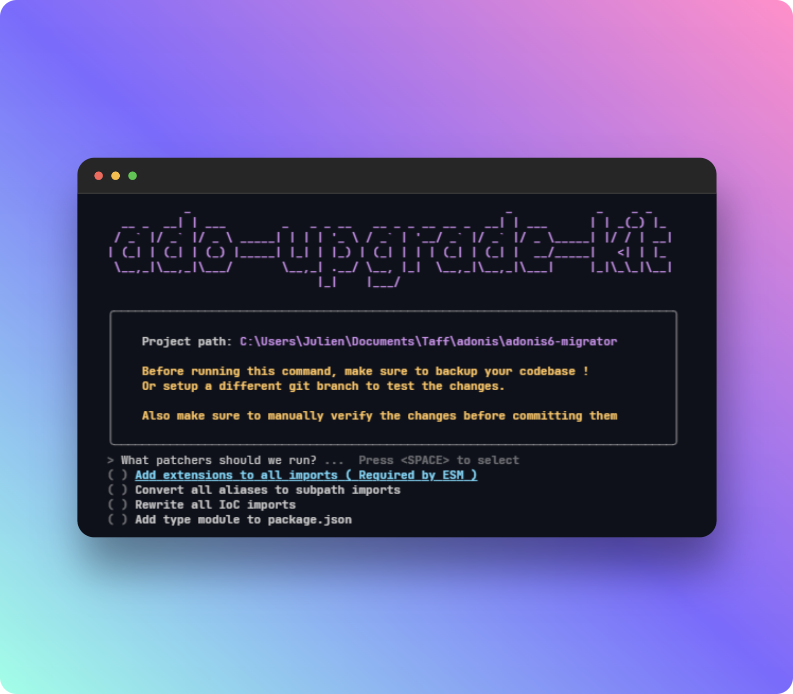

# Adonis.js upgrade kit
> CLI tool to upgrade Adonis.js v5 projects to v6

[![github-actions-image]][github-actions-url] [![npm-image]][npm-url] [![license-image]][license-url] [![typescript-image]][typescript-url]



`adonis-upgrade-kit` is a CLI tool to upgrade Adonis.js v5 projects to v6. It probably won't cover all the work and you'll still have some manual actions to do, but at least a lot of the boring work will be done by this tool.

Two commands are availables : 

- `adonis-upgrade-kit migrate:imports` : Get rid of the `@ioc:...` imports, add extensions to the imports, replace aliases imports with subpath imports, add `type: module` to the `package.json`.
- `adonis-update-kit migrate:configs` : Migrate some of the config files to the new format.

## Installation

```bash
npm i -g @adonisjs/upgrade-kit
```

## Flags

| Flag | Description |
|---|---|
| `-p, --path` | Path to the project to upgrade. Defaults to the current directory. |


[github-actions-image]: https://img.shields.io/github/actions/workflow/status/adonisjs/upgrade-kit/test.yml?style=for-the-badge "github-actions"

[github-actions-url]: https://github.com/adonisjs/upgrade-kit/actions/workflows/test.yml

[npm-image]: https://img.shields.io/npm/v/@adonisjs/upgrade-kit.svg?style=for-the-badge&logo=npm
[npm-url]: https://npmjs.org/package/@adonisjs/upgrade-kit "npm"

[license-image]: https://img.shields.io/npm/l/@adonisjs/upgrade-kit?color=blueviolet&style=for-the-badge
[license-url]: LICENSE.md "license"

[typescript-image]: https://img.shields.io/badge/Typescript-294E80.svg?style=for-the-badge&logo=typescript
[typescript-url]:  "typescript"
